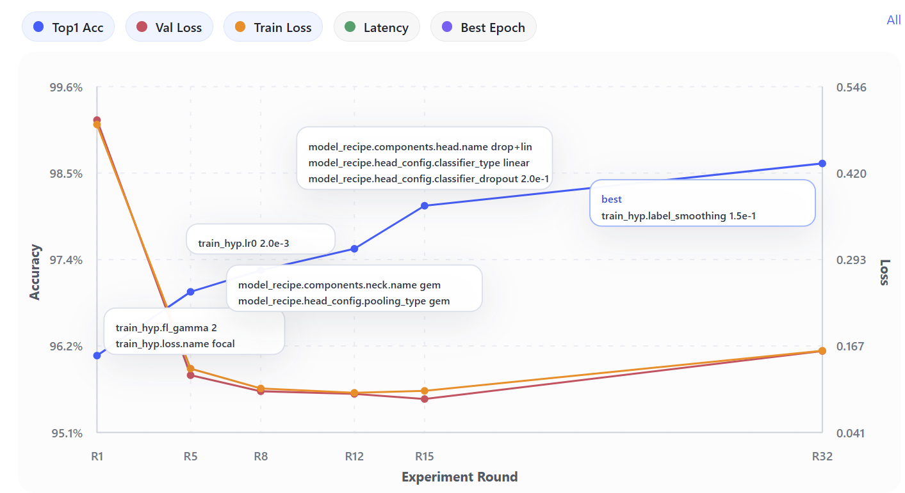

<div align="center">

# AutoVisionLab

<p>用 AI 自动化计算机视觉模型优化流程，构建实验分析工作流。</p>

<p>中文 | <a href="README.en.md">English</a></p>

<p>
  
  
  
  
</p>

</div>

工业视觉里的模型优化，很多时候仍然是偏手工的工作：调参数、跑实验、看结果、再改一轮。真正耗时的往往不是问题本身，而是重复试验、零散对比和来回切换工具。AutoVisionLab 关注的就是这一段重复流程。它把 AI 接入训练和实验闭环，让实验结果在完成后被自动收集、结构化，并进入统一的分析流程。

工程师仍然负责定义目标、约束和判断标准，AI 负责执行重复但必要的分析与迭代工作。系统会基于已有实验做比较、总结趋势，并给出下一步探索方向，让实验过程更容易追踪、比较和持续积累。

## 核心能力

- Compare：用于多模型 baseline 对比，集中查看关键指标差异
- Search：基于历史实验结果持续搜索更优配置，并追踪每一轮变化与当前最优路径

<table>
  <tr>
    <td width="50%" align="center">
      
    </td>
    <td width="50%" align="center">
      
    </td>
  </tr>
</table>

## 示例结果

以本地 NEU 搜索 run（`run_3bf12efc`）为例，它从 base 出发，通过一系列显式 delta 推进到了更强的 best 配置。

### 相对 Base 的累计 delta

| 阶段 | 实验 | Top-1 Acc | 相对 Base 的提升 | 变更内容 |
| --- | --- | ---: | --- | --- |
| Base | `exp_ec639557` | 0.9611 | - | `adamw`、`lr=0.003`、`avg_pool`、`linear`，不使用 mixup/cutmix/random erasing |
| Best path 1 | `exp_50f10900` | 0.9694 | +0.0083 | 切换为 `focal_loss`，并将 `focal_gamma` 设为 `2.0` |
| Best path 2 | `exp_782f439d` | 0.9722 | +0.0111 | 将 `learning_rate` 降到 `0.002` |
| Best path 3 | `exp_d206fd8b` | 0.9750 | +0.0139 | 将 neck 改为 `gem_pool` |
| Best path 4 | `exp_b56de8ec` | 0.9806 | +0.0195 | 增加 `dropout_linear` head |
| 当前最佳 | `exp_72c2a950` | 0.9861 | +0.0250 | 将 `label_smoothing` 提升到 `0.15` |

这条路径主要靠 focal loss、较低学习率、轻量结构改动和最后一次 label smoothing 提升拿到增益；后续的 mixup、cutmix、weight decay、focal gamma、batch size 和 image size 分支都没有超过当前 best。

<p align="center">
  
</p>

## 快速开始

0. 准备数据集。

   分类数据分成两层：

   - `data/raw/<dataset_name>/` 存按类别名分文件夹的图片
   - `data/classification/<dataset_name>/` 存由 `raw/` 生成的切分清单

   训练器读取的切分文件通常包括 `train.txt`、`val.txt`，以及可选的 `test.txt`。

   以仓库自带的 `NEU` 数据集为例：

   1. 从东北大学官方页面下载 `NEU-CLS`：[NEU surface defect database](http://faculty.neu.edu.cn/songkechen/zh_CN/zdylm/263270/list/)
   2. 将解压后的 `NEU-CLS` 放到 `data/raw/NEU-CLS/`
   3. 使用 `data/prepare_classification_split.py` 生成 `train.txt`、`val.txt` 和 `test.txt`

      ```bash
      python3 data/prepare_classification_split.py --source-dir data/raw/NEU-CLS --dataset-name NEU --val-ratio 0.2 --test-ratio 0.1 --seed 42 --force
      ```

   Demo Mode 可用于本地快速验证。开启后，如果数据集大于限制，会使用更小的确定性子集。

1. 创建并激活 Python 虚拟环境。

   ```bash
   python3 -m venv .venv
   source .venv/bin/activate
   pip install --upgrade pip
   ```

2. 安装后端依赖。

   ```bash
   pip install -r requirements.txt
   ```

3. 安装前端依赖。

   ```bash
   cd frontend/web
   npm install
   ```

4. 配置环境变量。

   ```bash
   cp .env.example .env
   ```

   在启动后端前填好 `.env` 中的 API key、模型和 base URL。

5. 启动后端和前端。

   ```bash
   ./scripts/run_backend.sh
   ./scripts/run_frontend.sh
   ```

默认地址：

- 后端：`http://127.0.0.1:8000`
- 前端：`http://127.0.0.1:5173`

## 文档导航

- [docs/overview.md](docs/overview.md)
- [docs/artifacts.md](docs/artifacts.md)
- [docs/llm.md](docs/llm.md)
- [docs/api.md](docs/api.md)
- [docs/schemas/model_recipe.md](docs/schemas/model_recipe.md)
- [docs/schemas/train_hyp.md](docs/schemas/train_hyp.md)
- [docs/schemas/dataset_recipe.md](docs/schemas/dataset_recipe.md)

## 许可

本项目采用 [Apache License 2.0](LICENSE)。

[如果这个项目对你有帮助，欢迎给仓库点个 Star：]
[](https://github.com/Fish0403/AutoVisionLab)
