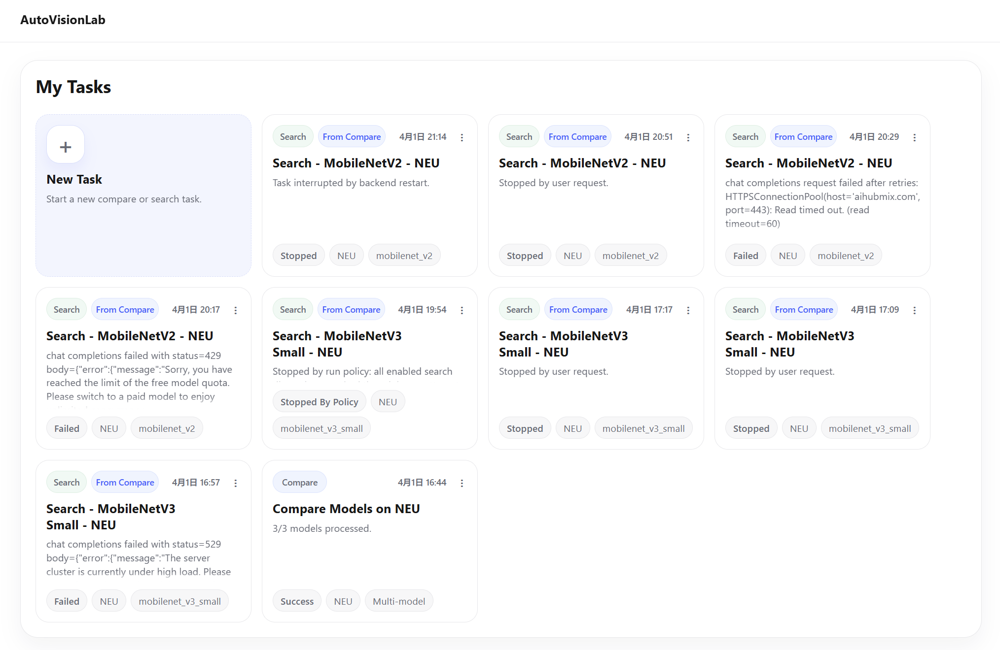
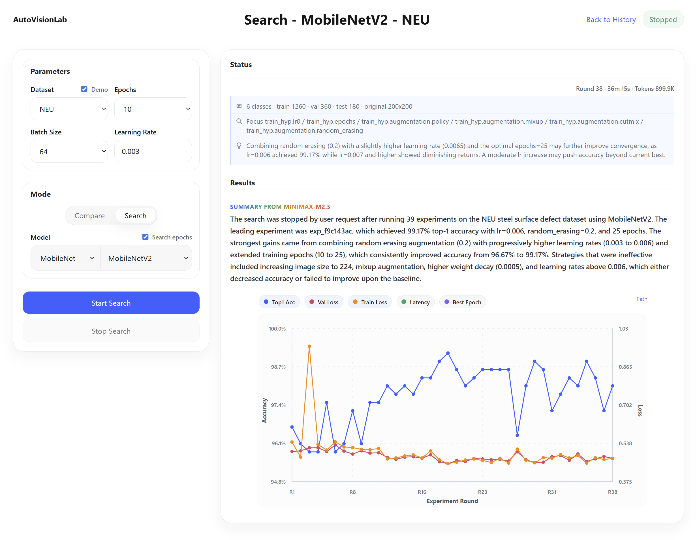
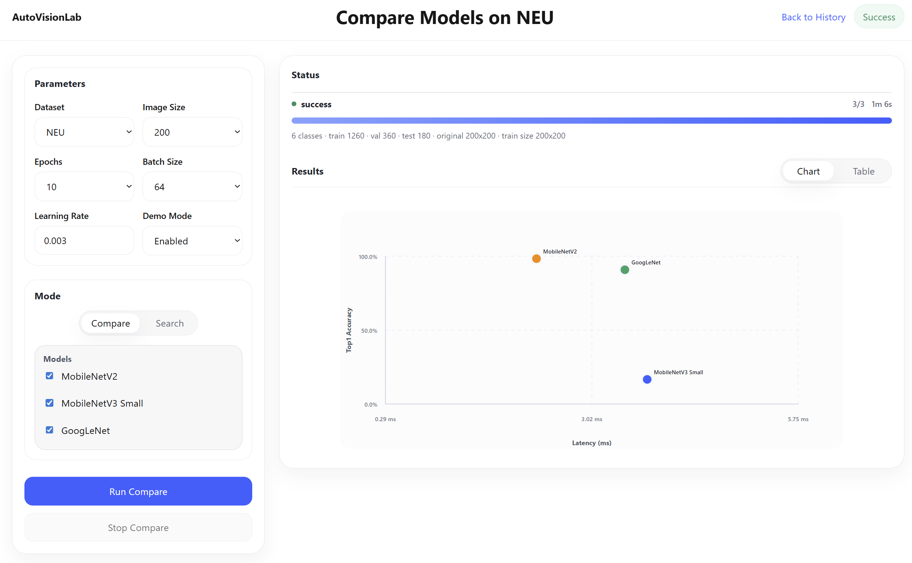

# AutoVisionLab

Industrial vision experimentation platform. The current implementation focuses on image classification and provides structured experiments, background auto-search, and cross-model comparison.

English | [中文](README.zh.md)


## Overview

AutoVisionLab uses `run` as the experiment container, `experiment` as the unit of training history, `task` as the background orchestration unit, and structured `proposal`, `result`, and `reflection` objects to connect AI search, training, and review.

Current implementation supports image classification with `MobileNetV2`, `MobileNetV3 Small`, `GoogLeNet`, and `ResNet18`. Other task types and models are still under development.

Current implementation includes:

- Image-classification training loop
- Structured `model_recipe`, `train_hyp`, and `dataset_recipe`
- Whitelisted parameter spaces and search-policy validation
- Background `Auto Train`
- Background `Compare Models`
- SQLite metadata storage and local artifact persistence







## Data and Artifacts

Classification data is prepared in two layers:

- `data/raw/<dataset_name>/` stores images grouped by class name
- `data/classification/<dataset_name>/` stores split manifests generated from `raw/`

The manifests are the files the trainer reads:

- Required: `train.txt` and `val.txt`
- Optional: `test.txt`

Use `data/prepare_classification_split.py` to scan the class folders under `data/raw/<dataset_name>/` and generate or refresh the split manifests.

Example:

```bash
python3 data/prepare_classification_split.py \
  --source-dir data/raw/your_dataset \
  --dataset-name your_dataset \
  --val-ratio 0.2 \
  --test-ratio 0.1 \
  --seed 42
```

Training artifacts are written locally:

- `artifacts/runs/<run_id>/run.log`
- `artifacts/runs/<run_id>/llm.jsonl`
- `artifacts/runs/<run_id>/experiments/<experiment_id>/recipe.json`
- `artifacts/runs/<run_id>/experiments/<experiment_id>/checkpoint.pt`

## Quick Start

1. Create and activate a Python virtual environment.

   ```bash
   python3 -m venv .venv
   source .venv/bin/activate
   pip install --upgrade pip
   ```

2. Install the backend dependencies.

   ```bash
   pip install -r requirements.txt
   ```

3. Install the frontend dependencies.

   ```bash
   cd frontend/web
   npm install
   ```

4. Start the backend and frontend.

   ```bash
   ./scripts/run_backend.sh
   ./scripts/run_frontend.sh
   ```

Default endpoints:

- Backend: `http://127.0.0.1:8000`
- Frontend: `http://127.0.0.1:5173`

Environment configuration:

- Copy `.env.example` to `.env`
- Configure the API key, model, and base URL before starting the backend
- Use the values shown in `.env.example` as the starting point

## Documentation

- [docs/overview.md](docs/overview.md)
- [docs/artifacts.md](docs/artifacts.md)
- [docs/llm.md](docs/llm.md)
- [docs/api.md](docs/api.md)
- [docs/schemas/model_recipe.md](docs/schemas/model_recipe.md)
- [docs/schemas/train_hyp.md](docs/schemas/train_hyp.md)
- [docs/schemas/dataset_recipe.md](docs/schemas/dataset_recipe.md)

If this project is useful to you, please leave a star.
